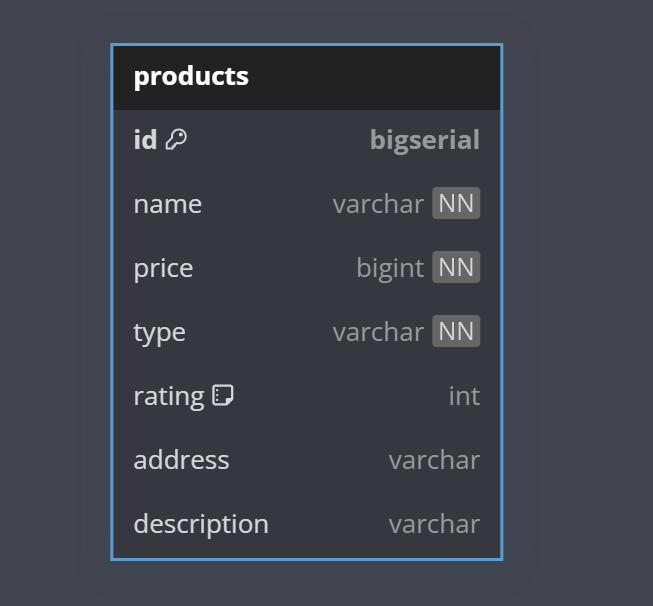

# A Crude Server

## Introduction 🔖
This server is a RESTful API designed to manage product resources efficiently. It supports the fundamental operations:

1. Create: Add new products to the database.
2. Read: Fetch product details or list products with filters.
3. Update: Modify existing product information.
4. Delete: Remove products from the database.
<br/>

The server utilizes PostgreSQL as its database, Prisma ORM for seamless database interaction, and Docker for a streamlined setup.
## Database schema


## How to run 🤔
Ensure that you installed `make` tools and `docker` are running on your machine.
<br/>
Check these tools are activating with these commands
```bash
make --version
docker --version
```

### Step 1: Clone github repository
```bash
git clone https://github.com/longtk26/Pham-Ngoc-Long.git
```
### Step 2: Redirect to problem5 folder using this command

```bash
cd Pham-Ngoc-Long/src/problem5
```
### Step 3: Setup .env file
When you are in `Pham-Ngoc-Long/src/problem5`. Create a `.env` file with the content follow in `.ex.env` file

### Step 4: Init environment
1. Run Postgres database
    ```bash
    make pre_env
    ```
    - This command will run docker-compose.yml file in environment folder and start a postgres database with port 5432
    - Username: `99tech`
    - Password: `99tech`
    - Database name: `99tech`   
    - You can change 3 parameters above in docker-compose.yml file
2. Migrate database
    ```bash
    make migrateup name=init_db
    ```
    - This command will migrate up postgres database and create a table `products` with the schema that i provided above.
3. Generate Prisma client 
    ```bash
    make genclient
    ```
    - This command will generate prisma client to interact with database. The operations supported are Get, Create, Update and Delete

### Step 5: Run application 🎇
```bash
make start
```
When the application started. You will see the output is
```bash
Server is running on port http://localhost:8080
Postgresql is connected
```