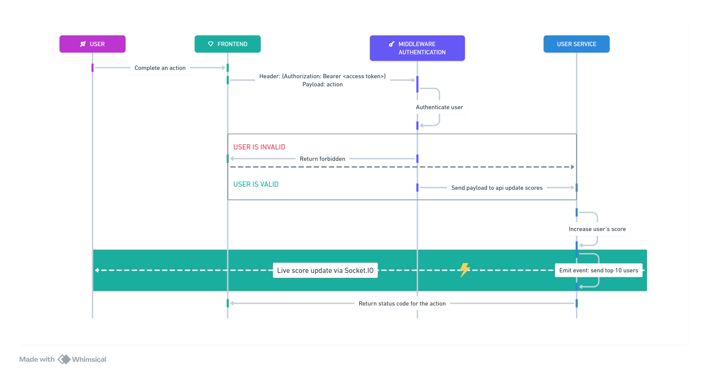

# Score Update Module

## Overview
This module handles the real-time update of user scores and the scoreboard. It ensures that user actions leading to score updates are authenticated and prevents unauthorized or malicious activities. The updated scores are reflected live on the top 10 leaderboard.

---

## Features
1. **Score Updates**: Updates the user's score when an action is completed.
2. **Authentication**: Verifies user credentials using a middleware authentication service to ensure secure updates.
3. **Top 10 Leaderboard**: Calculates and maintains the top 10 user scores.
4. **Real-Time Updates**: Sends live updates of the leaderboard via a socket connection to the frontend.
---

## Flow of Execution

### Step-by-Step Process
1. **User Action**: A user completes an action.
2. **Frontend Dispatch**: The frontend application sends an API request to the middleware authentication layer with the following:
    - **Header**: Contains the Authorization Bearer token.
    - **Payload**: Includes the action details.
3. **Middleware Authentication**:
    - Validates the user's token to confirm their identity.
    - If authentication fails, the process terminates, and an error is returned.
    - If successful, the payload is forwarded to the user service.
4. **User Service**:
    - Updates the user's score in the database.
    - Recalculates the top 10 user scores.
5. **Real-Time Update**:
    - The updated top 10 leaderboard is sent back to the frontend using a socket connection.
    - The frontend updates the leaderboard display for all users.

---

## API Endpoints
### **Update User Score**
**Endpoint**: `/api/v1/score/update`

**Method**: `POST`

**Headers**:
```
Authorization: Bearer <access_token>
```

**Payload**:
```json
{
  "action": "<action_detail>"
}
```

**Response**:
- **Success (200)**:
```json
{
  "message": "Score updated successfully."
}
```
- **Error (401)**:
```json
{
  "error": "Unauthorized access."
}
```
- **Error (500)**:
```json
{
  "error": "Internal server error."
}
```


## Security Considerations
1. **Authentication**: All requests must include a valid Authorization Bearer token.
2. **Rate Limiting**: Prevent spamming by limiting the number of API calls per minute.
3. **Data Validation**: Ensure all payloads are validated to prevent injection attacks.

---

## Error Handling
1. **Invalid Token**: Return a 401 Unauthorized response if the token is invalid.
2. **Database Failure**: Return a 500 Internal Server Error if updating scores or calculating the leaderboard fails.

## Potential Improvements for Performance Enhancement
1. Efficient Leaderboard Calculation
- Current Approach: Recalculating the top 10 user scores on every score update.
- Improvement: Implement a cached leaderboard that only updates when a user's score changes significantly enough to affect the top 10. This reduces database queries and computation.
2. Database Optimization
- Current Approach: Directly querying the database for every score update and leaderboard recalculation.
- Improvement:
  - Use batch updates to handle multiple score changes at once, - reducing database write operations.
  - Index the score column in the database for faster leaderboard queries.
  - Use a dedicated read-replica database for leaderboard queries to reduce load on the primary database.


